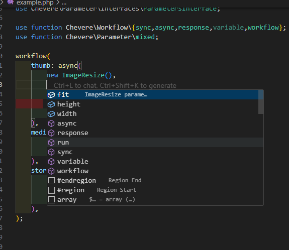

# Chevere Workflow VSCode Extension

A Visual Studio Code extension that provides autocompletion support for the [Chevere Workflow](https://github.com/chevere/workflow) PHP package.



## Features

- Intelligent autocompletion for Chevere Workflow functions and methods
- Code snippets for common patterns
- Quick help command with examples

### Autocompletion

The extension provides context-aware autocompletions for:

- Core Workflow functions: `workflow()`, `sync()`, `async()`, `variable()`, `response()`, `run()`
- Job methods: `withRunIf()`, `withDepends()`

Autocompletions include detailed descriptions and appropriate parameter placeholders.

### Snippets

The following snippets are available:

- `chevere-workflow-import`: Import all Chevere Workflow functions
- `chevere-workflow-class`: Create a class with WorkflowTrait
- `chevere-workflow-try`: Add a try-catch block for workflow error handling
- `chevere-action`: Create a basic Chevere Action class

### Command

- `Chevere Workflow: Show Help`: Opens a help panel with examples and documentation

## Requirements

- Visual Studio Code 1.70.0 or newer
- PHP files must use the Chevere Workflow package imports for autocompletion to work

## Installation

### From VS Code Marketplace

1. Open VS Code
2. Go to Extensions (Ctrl+Shift+X)
3. Search for "Chevere Workflow"
4. Click Install

### From VSIX File

1. Download the .vsix file from [Releases](https://gitlab.com/trinavoprivate/chevere-workflow-vscode/releases)
2. Open VS Code
3. Go to Extensions (Ctrl+Shift+X)
4. Click the "..." menu in the top-right of the Extensions panel
5. Select "Install from VSIX..." and choose the downloaded file

## Example Usage

```php
<?php

use function Chevere\Workflow\{workflow, sync, async, variable, response, run};

// Define a workflow
$workflow = workflow(
    validate: sync(
        new ValidateImage(),
        file: variable('file')
    ),
    thumb: async(
        new ResizeImage(),
        file: variable('file'),
        width: 150
    ),
    store: sync(
        new StoreFile(),
        file: response('thumb', 'path')
    )
);

// Run the workflow
try {
    $run = run(
        workflow: $workflow,
        arguments: [
            'file' => '/path/to/image.jpg'
        ]
    );
    $storedPath = $run->response('store')->string();
} catch (\Chevere\Workflow\Exceptions\WorkflowException $e) {
    // Handle error
}
```

## Development

### Building from Source

1. Clone the repository

```bash
git clone https://gitlab.com/trinavoprivate/chevere-workflow-vscode.git
cd chevere-workflow-vscode
```

1. Install dependencies

```bash
npm install
```

1. Run ESLint

```bash
npm run lint
```

1. Package the extension

```bash
npm run package
```

## License

This extension is licensed under the Apache License 2.0 - see the [LICENSE](LICENSE) file for details.

## Acknowledgments

- [Chevere Workflow](https://github.com/chevere/workflow) - The PHP library this extension supports

## Support

If you like this extension, please consider supporting me with a coffee.
[](https://buymeacoffee.com/doonfrs)
